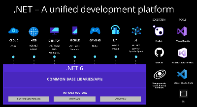

# Welcome to the Intro to Web Dev with .NET series
In this Welcome, we’ll introduce ourselves, give you the lesson rundown, take you on a tour of the .NET ecosystem, and show you all the tools you’ll need to build the projects. 

## Prerequisite tools
- [Visual Studio](https://aka.ms/WebLearningSeries-git-vsDownload) or [Visual Studio for Mac](https://aka.ms/WebLearningSeries-git-vsmacDownload) - check out our [more detailed instructions](/1-welcome/how-to-install-vs.md) for extra help 
- [.NET 6 SDK](https://aka.ms/WebLearningSeries-git-dotnetDownload)

During the series you will learn the basics of C#, building websites and web APIs, and even how to publish your apps to the cloud. Here is a rundown of what the next few weeks will look like. 

## Who are we?
Let us introduce ourselves. The content in this series is all written by .NET Developer Community Team from Microsoft. More specifically, Jon, James, Jeff, and Katie will be teaching you web development and all things .NET. 

## What to expect
- Week 1 – Welcome!  
- Week 2 – C# for web development crash course 
- Week 3 – We'll build our first pizza website with Razor Pages 🍕 
- Week 4 – Upgrade our pizza website with a backend using Minimal web APIs 
- Week 5 – Create a Connect 4 Interactive Web Applications with Blazor 
- Week 6 – Connect to the cloud by publishing with Azure 

To start you on your journey I want to give you a brief overview of what C# and .NET are, and what tools you will need to get going. 

## What is .NET? 
.NET is a free, cross-platform, open source developer platform for building many different types of applications. This platform is used by companies of all different industries and different sizes. If you’ve ever used Stack Overflow, eaten Chipotle, or received a package delivered by UPS, then you’ve interacted with .NET! 

With .NET, you can use multiple languages, editors, and libraries to build for web, mobile, desktop, games, IoT, and more! 

For this series we’ll use ASP.NET Core and Blazor to build web apps! 
