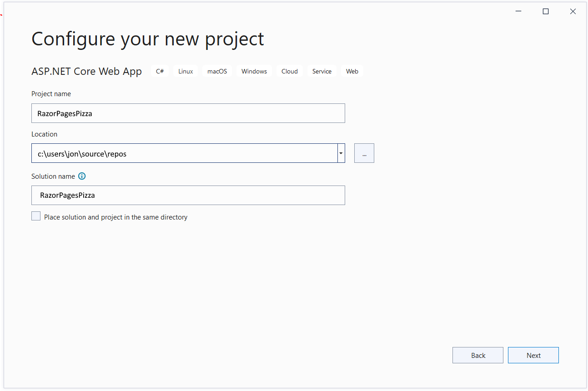
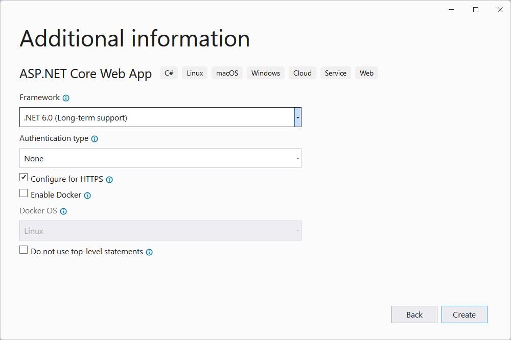
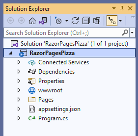
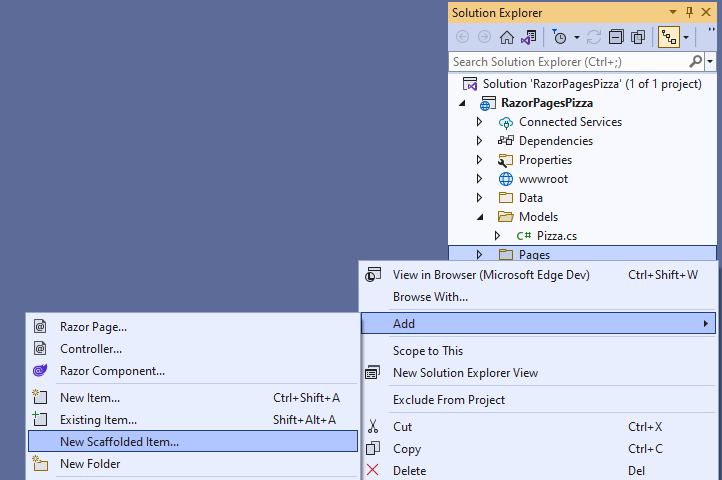
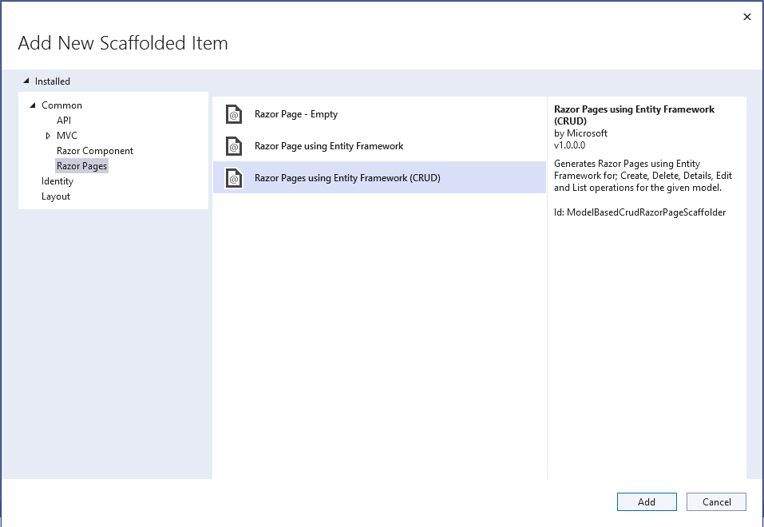
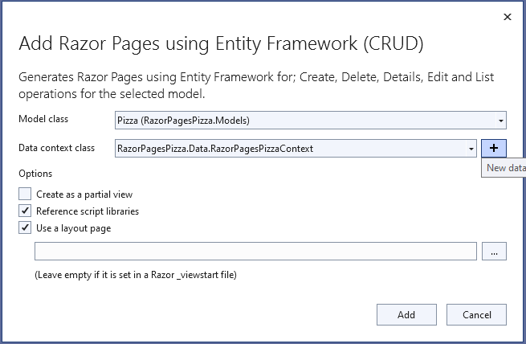
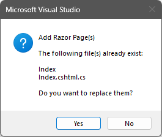

# Build a pizza website with Razor Pages

Welcome back! In the last lesson, you got a crash course in C# language fundamentals. Now, you'll get to put those skills to use and build a website using ASP.NET Core and Razor Pages!

## What's ASP.NET Core?

.NET is pretty magical, because you can build all kinds of apps with it – mobile apps, games, desktop apps, web apps, and more. ASP.NET Core is a .NET toolkit for building web sites, apps, and services with .NET.

## Okay, so what are Razor Pages?

There are a few different kinds of web apps out there. If you’re building highly interactive web apps – like a game or in-browser experience – you would probably want to use Blazor. You’ll learn about that in Week 5. But the huge majority of web sites out there run most of their logic on the server  - think shopping and commerce websites, web sites for small businesses and portfolios, news sites, etc. And that’s what Razor Pages is really good at.

In Razor Pages applications, you’ll write your logic in a Page Model class, and you’ll write your markup in a Razor file. Razor is a nifty language that blends HTML markup with C# logic, so you can pull in your dynamic information from your Page Model class and display it in Razor. If that sounds complicated, don’t worry, because you’re about to see how easy it is to write a simple Pizza store web app using Razor Pages.  

## Installing the tools

We'll be using Visual Studio 2022 for whole course. If you don't have Visual Studio 2022 installed, you can follow the [directions here](/1-welcome/how-to-install-vs.md).

## Creating a Razor Pages project

1. Start Visual Studio 2022 and select **Create a new project**.

   

1. In the **Create a new project** dialog, select **ASP.NET Core Web App**, and then select **Next**.

   

1. In the **Configure your new project** dialog, enter `RazorPagesPizza` for **Project name**. It's important to name the project *RazorPagesPizza*, including matching the capitalization, so the namespaces will match when you copy and paste example code.

   

1. Select **Next**.

1. In the **Additional information** dialog, select **.NET 6.0 (Long-term support)** and then select **Create**.

   

   The following starter project is created:

   

## Setting up our model class

In the **Project** menu, select **New Folder**. Name the folder **Models**.

With the **Models** folder still selected in the Solution Explorer, select **Project** -> **Add Class...** from the menu. Name the new class **Pizza.cs** and click the **Add** button.

In the **Pizza.cs** file, add the following code:

```csharp
using System.ComponentModel.DataAnnotations;

namespace RazorPagesPizza.Models;

public class Pizza
{
    public int Id { get; set; }

    [Required]
    public string? Name { get; set; }
    public bool IsGlutenFree { get; set; }

    [Range(0.01, 9999.99)]
    public decimal Price { get; set; }
}
```

Before proceeding to the next step, build the project by selecting **Build Solution** from the **Build** menu.

## Scaffolding our Razor Pages project

Right-click on the **Pages** directory in the Solution Explorer, and select **Add** -> **New Scaffolded Item...**.

> NOTE: It is important that you right-click the **Pages** directory when you add a new scaffolded item. This is because the **Pages** directory is a special folder in the Solution Explorer that contains all of the Razor Pages files.

   

In the **Add New Scaffold Item** dialog, select **Razor Pages**, **Razor Pages using Entity Framework (CRUD)** and then select **Add**.

   

In the **Add Razor Pages using Entity Framework (CRUD)** dialog, select **Pizza (RazorPagesPizza.Models)** for the model class.

Click the **+** button to the right of the **Data context class** field. The **New data context type** field will be pre-filled with `RazorPagesPizza.Data.RazorPagesPizzaContext`. Click the **Add** button.

Verify that the dialog looks like this, then click the **Add** button:

   

You will receive a warning that you are overriding the existing **Index** files. Click the **Yes** button to continue.

   

## Check out the IndexModel class

Let's take a look at how a sample page in the site works - we'll start with the Index page. As explained earlier, the logic in a Razor Page goes in a Page Model class, and you’ll write your markup in a Razor file. We'll look at how those work, starting with the Index `PageModel`.

A Razor page's `PageModel` class file defines any page handlers for HTTP requests sent to the page, and data used to render the page. The `PageModel` keeps those concerns separate from the Razor page, your app more modular, and easier to maintain. By convention, the `PageModel` class is named *[PageName]Model* and resides in the same namespace as the Razor page.

```csharp
using System;
using System.Collections.Generic;
using System.Linq;
using System.Threading.Tasks;
using Microsoft.AspNetCore.Mvc;
using Microsoft.AspNetCore.Mvc.RazorPages;
using Microsoft.EntityFrameworkCore;
using RazorPagesPizza.Data;
using RazorPagesPizza.Models;

namespace RazorPagesPizza
{
    public class IndexModel : PageModel
    {
        private readonly RazorPagesPizza.Data.RazorPagesPizzaContext _context;

        public IndexModel(RazorPagesPizza.Data.RazorPagesPizzaContext context)
        {
            _context = context;
        }

        public IList<Pizza> Pizza { get;set; } = default!;

        public async Task OnGetAsync()
        {
            if (_context.Pizza != null)
            {
                Pizza = await _context.Pizza.ToListAsync();
            }
        }
    }
}
```

A `PageModel` really has two jobs:

* It assembles all the dynamic content you'll want to show in the page.
* It handles all the page interactions, which normally map to HTTP verbs like GET, POST, DELETE, etc.

The `IndexModel` uses EF Core to work with the database, allowing the `OnGetAsync` method to be pretty short. A database context called `_context` is kind of magically created for us in the class constructor (it's actually using ASP.NET Core's [dependency injection system](https://docs.microsoft.com/aspnet/core/fundamentals/dependency-injection), but it's okay to just treat it as magic for now). EF Core allows us to just work with a C# list of items (our `Pizza` class in this case), and it does the work to synchronize our changes with a database.

Currently, the `IndexModel` class handles the HTTP GET request with an `OnGetAsync` page handler. You can add handlers for any HTTP verb. The most common handlers are:

* `OnGetAsync` to initialize state needed for the page.
* `OnPostAsync` to handle form submissions. You can see an example in `Create.cshtml.cs`, and learn more about how form submissions work in the references in the **What's Next** section below.

## And now the Index page's Razor file

Now that we've got a list of pizzas loaded into a variable (`Pizza` in this case), we can display it in the page. A Razor page supports Razor syntax, which is HTML and C# combined. The C# code defines the dynamic rendering logic for the page on the server. The default Razor language is HTML. Rendering HTML from Razor markup is no different than rendering HTML from an HTML file. HTML markup in .cshtml Razor page files is rendered by the server unchanged. In Razor Pages, HTML can be used as you're used to. At the same time, you can take advantage of powerful and time-saving Razor features as you learn to use them.

You'll see below that we're transitioning between C# and HTML - starting with some C# to set a few things, then switching over to HTML with our `<h1>` tag. From then on, it's mostly HTML with some dynamic content sprinkled in.

```csharp
@page
@model RazorPagesPizza.IndexModel

@{
    ViewData["Title"] = "Index";
}

<h1>Index</h1>

<p>
    <a asp-page="Create">Create New</a>
</p>
<table class="table">
    <thead>
        <tr>
            <th>
                @Html.DisplayNameFor(model => model.Pizza[0].Name)
            </th>
            <th>
                @Html.DisplayNameFor(model => model.Pizza[0].IsGlutenFree)
            </th>
            <th>
                @Html.DisplayNameFor(model => model.Pizza[0].Price)
            </th>
            <th></th>
        </tr>
    </thead>
    <tbody>
@foreach (var item in Model.Pizza) {
        <tr>
            <td>
                @Html.DisplayFor(modelItem => item.Name)
            </td>
            <td>
                @Html.DisplayFor(modelItem => item.IsGlutenFree)
            </td>
            <td>
                @Html.DisplayFor(modelItem => item.Price)
            </td>
            <td>
                <a asp-page="./Edit" asp-route-id="@item.Id">Edit</a> |
                <a asp-page="./Details" asp-route-id="@item.Id">Details</a> |
                <a asp-page="./Delete" asp-route-id="@item.Id">Delete</a>
            </td>
        </tr>
}
    </tbody>
</table>
```

Razor has a pretty lightweight syntax, so if you're familiar with HTML you can start with that and add in dynamic content and logic. There's more information about the [Razor syntax](https://docs.microsoft.com/aspnet/core/mvc/views/) in the docs, of course, and we cover it in a little more detail in the **What's Next** tutorial.

## Run database migrations

From the **Tools** menu, select **NuGet Package Manager** > **Package Manager Console**.

   

In the Package Manager Console, or PMC, enter the following commands:

```powershell
Add-Migration InitialCreate
Update-Database
```

## Running the web app

From the **Build** menu, select **Start Debugging**. A console window will open to display debug output, and your browser will open to the web application's URL. It will be something like https://localhost:7242/, where the 7242 is a free port number on your machine.

You've got a running web application that you built! Let's try it out.

1. Click the **Create New** link to navigate to the **Create** page. Try to break it by leaving all the fields blank and clicking the **Create** button. You'll see validation errors, which is a good thing!

1. Enter a valid pizza name (pineapple is allowed!) and price (between 0.01 and 9999.99 - we've got some expensive pizza here) and click the **Create** button.

1. Play with it a bit by adding a few pizzas and deleting them.

   

## What's next?

In order to get started quickly, we've kept things as simple as we could, and we've taken advantage of scaffolding to write a lot of code for us. We've got some more advanced tutorials to help you get to the next level, though:

* [Create a web UI with ASP.NET Core](https://docs.microsoft.com/learn/modules/create-razor-pages-aspnet-core/) will walk you through a very similar Pizza application, but in more detail. You'll learn more about how things are working behind the scenes, and write more of the code by hand.

* [Create a Razor Pages web app with ASP.NET Core](https://docs.microsoft.com/aspnet/core/tutorials/razor-pages/) goes even deeper, with more advanced data operations like search and adding new fields to your data model.

## Connect with us

We're excited to support you on your learning journey! Check out the [.NET Community Page](https://dotnet.microsoft.com/platform/community) to find links to our blogs, YouTube, Twitter, and more.

# How'd it go?

Please take this quick, [10 question survey](https://aka.ms/WebLearningSeries-git-survey) to give us your thoughts on this lesson & challenge!