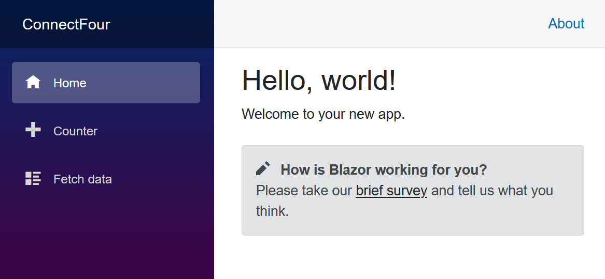
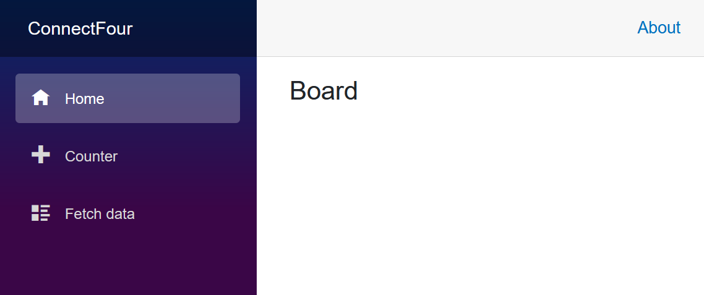
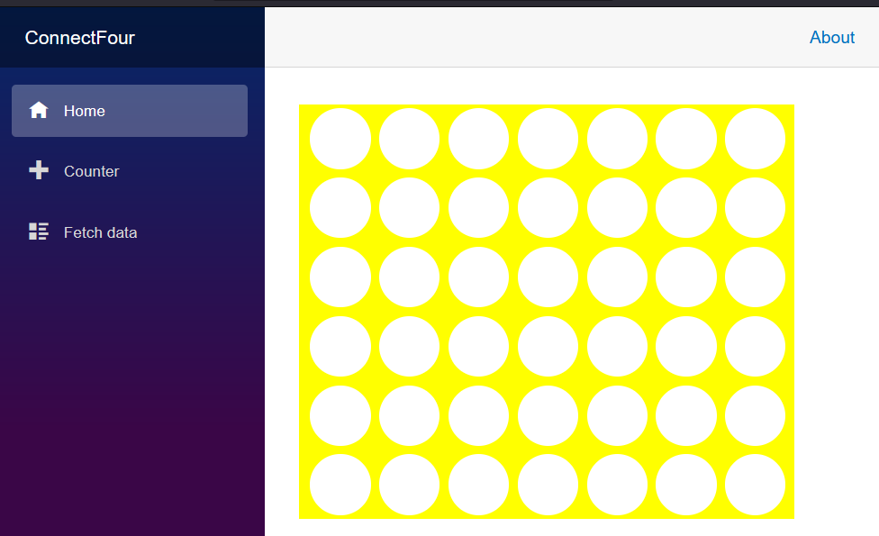
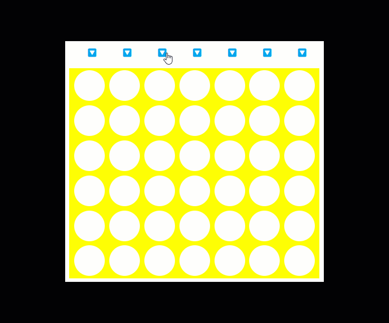
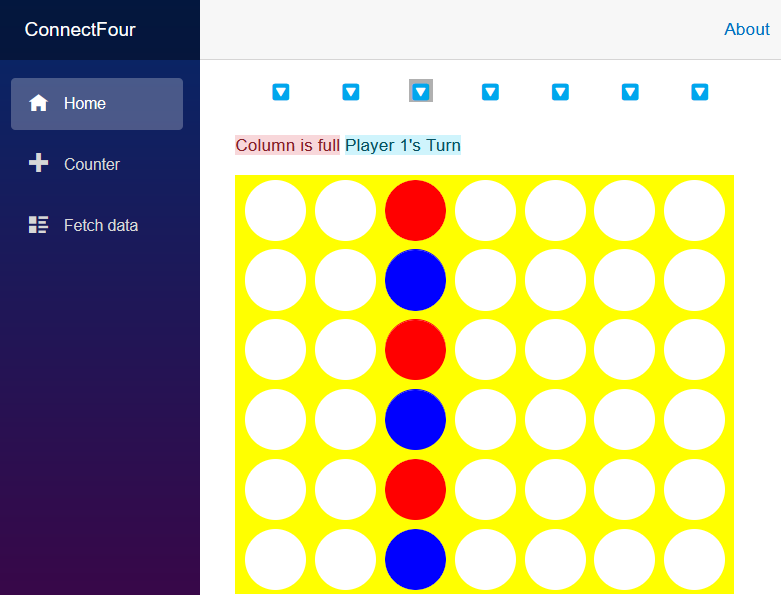
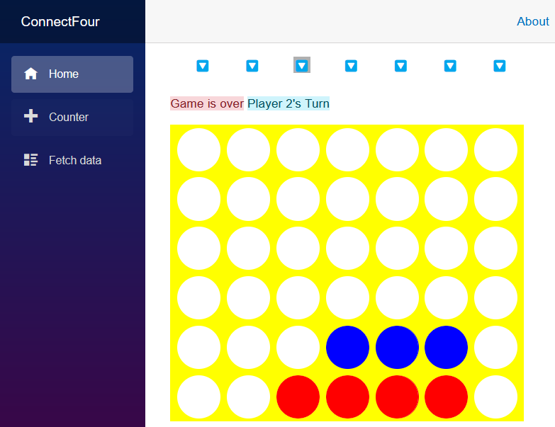
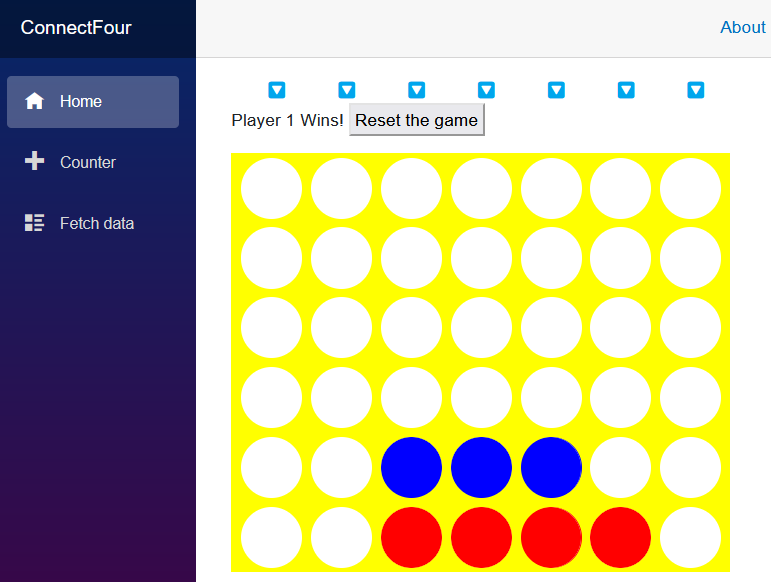
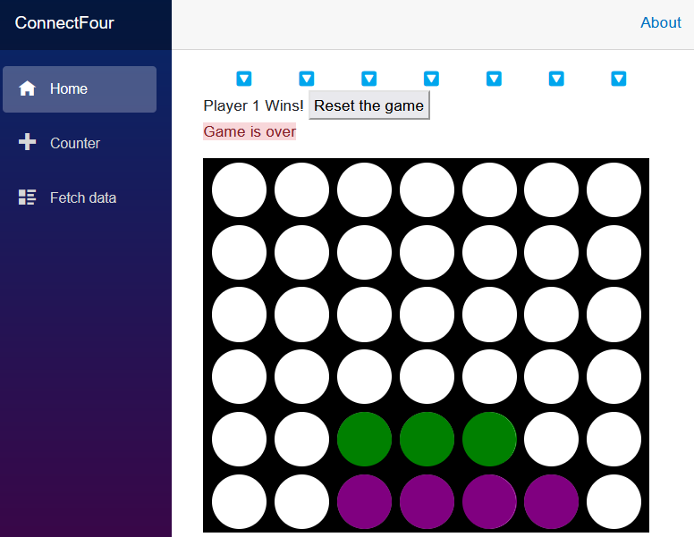

# Introducing Blazor Web Applications

Today we're going to learn how to build a Blazor application by recreating the classic four-in-a-row game, Connect Four.

## What is Blazor

Blazor is a framework for building web pages with HTML, CSS, and C#.  We can define the layout and design of the website using standard HTML and CSS.  The interactive components of the web pages can then be managed with C# code that runs on a server or in the browser using a web standard technology called WebAssembly.  The formatting of HTML and CSS will build on what we learned in our previous sessions, using the Razor template language.
Blazor allows us to define our web pages using Razor and include other Razor files as components inside those pages.  This means we can build and re-use parts of our application easily.

## What is WebAssembly?

WebAssembly is a standard technology available in every modern browser that allows code to run, similar to JavaScript, in a browser.  We can use tools to prepare our C# code for use in the browser as a web assembly application, and these tools are bundled into the .NET command-line application.

## Structure of this repository

We're including all of the layout and game logic in this repository as well as a completed sample Blazor Connect Four application to compare your progress with.  We'll walk through the initial construction of the application using the .NET command-line, and you can find an instance of that code with the CSS and game logic in the [0-start](0-start) folder of this repository.  The completed state of the game can be found in the [1-complete](1-complete) folder.

## What we're building	

This repository will walk you through Blazor and introduce the following concepts:

-	Blazor component fundamentals
-	How to get started with the Blazor WebAssembly project template
-	How to construct and use a layout for a Blazor component
-	How to react to user interactions

We'll accomllish this by writing a classic four-in-a-row "Connect Four" game that runs in your browser using WebAssembly.  In this game, 2 players alternate taking turns placing a gamepiece (typically a checker) in the top of the board.  Game pieces fall to the lowest row of a column and the player that places 4 game pieces to make a line horizontally, vertically, or diagonally wins.

## Create a new Blazor project

First, let's scaffold a new project for our game.  With .NET 6 installed, we can start building our application at the command-line.

1. Create a new blazor application in Visual Studio 2022 by choosing the "File - New... - Project" menu.

1. Choose a "Blazor WebAssembly App" from the list of templates and name it "ConnectFour".  Click next

1. Choose the .NET 6 framework, Authentication type should be set to "None" and uncheck the "ASP.NET Core hosted" checkbox.

	This should create a _ConnectFour_ directory containing our application.

2. Run the app by pressing <kbd>F5</kbd> in Visual Studio 2022.  This builds the app and hosts it on a random port between 5000 and 5300.  HTTPS has a port selected for it in the range of 7000 to 7300.

	Your Output Window should report content similar to the following:

	```output
	Building...
	info: Microsoft.Hosting.Lifetime[14]
		Now listening on: https://localhost:7296
	info: Microsoft.Hosting.Lifetime[14]
		Now listening on: http://localhost:5136
	info: Microsoft.Hosting.Lifetime[0]
		Application started. Press Ctrl+C to shut down.
	info: Microsoft.Hosting.Lifetime[0]
		Hosting environment: Development
	info: Microsoft.Hosting.Lifetime[0]
		Content root path: C:\dev\ConnectFour
	```

1. Let's navigate to the address our web server announced it's serving the application at.  You might be able to Ctrl+Click on the address in your terminal, or just copy the address into your browser.  In the above sample, we would navigate to `http://localhost:5136`.  You should be presented with the following welcome screen in your browser:

	

	Congratulations!  You've created your first Blazor application using the Blazor WebAssembly template.

## Create a Board component

Next, let's create a board component to be used by players in our game.  The component is defined using Razor syntax, which is a mix of HTML and C#. 

1. Right-click on the **Shared** folder in the Solution Explorer of Visual Studio.  Choose "Add - Razor Component" from the context menu and name the file `Board.razor`.  Place this file in the **Shared** folder and this will allow the component to be referenced and used throughout the application. We will use this component to hold everything needed for the game-board layout and managing interactions with it.

	The initial contents of this new component are a simple H3 tag and a code block indicating where C# code should be written:

	```csharp
	<h3>Board</h3>

	@code {

	}
	```

1. Prepare our Index page by opening the `Pages/Index.razor` file.  Clear out everything after the 3rd line with the PageTitle tags.

	```csharp
	@page "/"

	<PageTitle>Index</PageTitle>
	```

1. We can add our `Board` component to the `Index` page by just adding a tag with the filename of our component to the `Index` page.

	```csharp
	@page "/"

	<PageTitle>Index</PageTitle>

	<Board></Board>
	```

	The `Index.razor` file is a **Page** that can be navigated to and contains HTML, C#, and references to other Blazor components.  We can identify this file as a page due to the presence of the `@page "/"` directive on the first line.  This instructs Blazor to respond with the contents of this file when the default page at the "/" address is requested.

	Let's run our application with <kbd>F5</kbd> and in the hot-reload toolbar button activate the "Hot reload on file save" option.  The hot-reload feature will patch and rebuild our application, and then refresh our browser as we add new features to the application.  Hot reload allows you to observe the evolution of the game from a simple page to a full Connect Four board with interactive pieces.

	

	Congratulations!  You've just built your first component and used it on a Blazor page.

## Adding layout and style to our board

Blazor components contain all of the HTML and markup needed to be rendered in a web browser.  Let's start defining a game board with the 7 columns and 6 rows.  We'll then add a little style to bring our board to life.

1. In the `Board.razor` file let's remove the HTML at the top and add the following content to define a board with 42 places to move.  
  
	We can mix in some C# code in the form of a for loop to generate the 42 board positions.  Just like razor pages and MVC views, we indicate the start of our C# code with an `@` symbol.  Razor will continue interpreting C# code after the `@` until it identifies a tag that it will then render normally.  In this case, the **span** tag will be picked up and repeated with its contents 42 times.

	```csharp
	<div>
		<div class="board">
			@for (var i = 0; i < 42; i++)
			{
				<span class="container">
					<span></span>
				</span>
			}
		</div>
	</div>
	```

	It may seem strange to allocate 42 `span` elements inside of a `div`.  When we save the board component, our application refreshes and it appears as an empty page.

	You may be prompted by Visual Studio to restart your app as files change.  Confirm that the application should be rebuilt on code edits, and our application will automatically restart and refresh the browser for us as we add features.

2. Let's add some style to this component.  Blazor components can define content to be added to the HTML head of the page using a special **HeadContent** tag.  Let's define some colors for the frame of the board and the players just above the first **div** tag of our `Board.razor` file:

	```csharp
	<HeadContent>
		<style>
			:root {
				--board-bg: yellow; 	/** the color of the board **/
				--player1: blue;		/** Player 1's piece color **/
				--player2: red;			/** Player 2's piece color **/
			}
		</style>
	</HeadContent>

	<div>
	...
	```

	This **style** tag and contents will be delivered inside the **head** tag on the page. These CSS variables will be picked up and used in the rest of our stylesheet for this component.

3. Next, we'll add a completed stylesheet for the game from the `0-start` folder in this repository.  Right-click in the Solution Explorer on the **Shared** folder and create a new CSS file called `Board.razor.css`.  Copy the following content into the new `Board.razor.css` file:

	```css
	div{position:relative}nav{top:4em;width:30em;display:inline-flex;flex-direction:row;margin-left:10px}nav span{width:4em;text-align:center;cursor:pointer;font-size:1em}div.board{margin-top:1em;flex-wrap:wrap;width:30em;height:24em;overflow:hidden;display:inline-flex;flex-direction:row;flex-wrap:wrap;z-index:-5;row-gap:0;pointer-events:none;border-left:10px solid var(--board-bg)}span.container{width:4em;height:4em;margin:0;padding:4px;overflow:hidden;background-color:transparent;position:relative;z-index:-2;pointer-events:none}.container span{width:3.5em;height:3.5em;border-radius:50%;box-shadow:0 0 0 3em var(--board-bg);left:0;position:absolute;display:block;z-index:5;pointer-events:none}.player1,.player2{width:3.5em;height:3.5em;border-radius:50%;left:0;top:0;position:absolute;display:block;z-index:-8}.player1{background-color:var(--player1);animation-timing-function:cubic-bezier(.5,.05,1,.5);animation-iteration-count:1;animation-fill-mode:forwards;box-shadow:0 0 0 4px var(--player1)}.player2{background-color:var(--player2);animation-timing-function:cubic-bezier(.5,.05,1,.5);animation-iteration-count:1;animation-fill-mode:forwards;box-shadow:0 0 0 4px var(--player2)}.col1{left:calc(0em + 9px)}.col2{left:calc(4em + 9px)}.col3{left:calc(8em + 9px)}.col4{left:calc(12em + 9px)}.col5{left:calc(16em + 9px)}.col6{left:calc(20em + 9px)}.col7{left:calc(24em + 9px)}.drop1{animation-duration:1s;animation-name:drop1}.drop2{animation-duration:1.5s;animation-name:drop2}.drop3{animation-duration:1.6s;animation-name:drop3}.drop4{animation-duration:1.7s;animation-name:drop4}.drop5{animation-duration:1.8s;animation-name:drop5}.drop6{animation-duration:1.9s;animation-name:drop6}@keyframes drop1{100%,75%,90%,97%{transform:translateY(1.27em)}80%{transform:translateY(.4em)}95%{transform:translateY(.8em)}99%{transform:translateY(1em)}}@keyframes drop2{100%,75%,90%,97%{transform:translateY(5.27em)}80%{transform:translateY(3.8em)}95%{transform:translateY(4.6em)}99%{transform:translateY(4.9em)}}@keyframes drop3{100%,75%,90%,97%{transform:translateY(9.27em)}80%{transform:translateY(7.2em)}95%{transform:translateY(8.3em)}99%{transform:translateY(8.8em)}}@keyframes drop4{100%,75%,90%,97%{transform:translateY(13.27em)}80%{transform:translateY(10.6em)}95%{transform:translateY(12em)}99%{transform:translateY(12.7em)}}@keyframes drop5{100%,75%,90%,97%{transform:translateY(17.27em)}80%{transform:translateY(14em)}95%{transform:translateY(15.7em)}99%{transform:translateY(16.5em)}}@keyframes drop6{100%,75%,90%,97%{transform:translateY(21.27em)}80%{transform:translateY(17.4em)}95%{transform:translateY(19.4em)}99%{transform:translateY(20.4em)}}
	```

	For convenience, you can also find this content in the [0-start/Shared/Board.razor.css](0-start/Shared/Board.razor.css) file in this repository.

	Blazor components and pages have a feature called CSS isolation that allows you to create style rules that will only be applied to the contents of that component or page.  By creating a file with the same name as our component and adding the `.css` filename extension, Blazor will recognize this as the styles that should **ONLY** be applied to HTML content in the `Board.razor` template.

	Here is some of the CSS used to format the board and 'punch holes' for each of the spaces.  There is much more content than this in the CSS file, and we'll use that for the game pieces and their animations on screen.

	```css
	div.board {
		margin-top: 1em;
		flex-wrap: wrap;
		width: 30em;
		height: 24em;
		overflow: hidden;
		display: inline-flex;
		flex-direction: row;
		flex-wrap: wrap;
		z-index: -5;
		row-gap: 0;
		pointer-events: none;
		border-left: 10px solid var(--board-bg);
	}

	span.container {
		width: 4em;
		height: 4em;
		margin: 0;
		padding: 4px;
		overflow: hidden;
		background-color: transparent;
		position: relative;
		z-index: -2;
		pointer-events: none;
	}

	.container span {
		width: 3.5em;
		height: 3.5em;
		border-radius: 50%;
		box-shadow: 0 0 0 3em var(--board-bg);
		left: 0px;
		position: absolute;
		display: block;
		z-index: 5;
		pointer-events: none;
	}
	```

	Your browser should be refreshed for you (if not you can manually refresh the browser with F5), and you should be greeted with a proper yellow Connect Four board:

	

## Introducing Game Logic and Controls

The game logic for Connect Four is not too difficult to program.  We need some code that will manage the state of the game and identify 4 consecutive game pieces played next to each other and announce the winner.  To help keep this tutorial on-topic with teaching about Blazor, we are providing a class called `GameState.cs` that contains the logic for managing the game.  

The [GameState.cs file is in this repository](1-complete/ConnectFour/Shared/GameState.cs) and you will copy it into your version of the game.

1. Copy the [GameState.cs file](1-complete/ConnectFour/Shared/GameState.cs) from this repository into your project in the `Shared` folder.

1. We need to make an instance of the `GameState` available to any component that requests it, and only 1 instance of `GameState` should be available in our application at a time.  We will address this need by registering our GameState as a Singleton in the application.  Open the `Program.cs` file at the root of the project and let's add this statement after the `builder.AddServices...` statement:

	```csharp
	builder.Services.AddSingleton<ConnectFour.Shared.GameState>();
	```

	We can now **inject** an instance of our `GameState` into our `Board` component to work with.

1. At the top of the `Board.razor` file, add the following directive to inject the current state of the game into the component:

	```csharp
	@inject ConnectFour.Shared.GameState State
	```

	We can now start connecting our Board component to the state of the game.  

1. Let's begin by resetting the state of the game when the **Board** component is first painted on screen.  The event that handles this initialization of the component is called `OnInitialized`.  Let's add some code to reset the state of the game when the component is initialized.  Inside the `@code` block at the bottom of the `Board.razor` file, let's add this method, called an event handler:

	```csharp
	@code {
		protected override void OnInitialized()
		{
			State.ResetBoard();
		}
	}
	```

	When the board is first shown to a user, the state will be reset to the beginning of a game.

2. Next, let's allocate the possible 42 game pieces that could be played.  This should be an array that is referenced by 42 HTML elements that will be managed as pieces are played on the board.  We can move and place those pieces by assigning a set of CSS classes with column and row positions.

	Let's allocate those 42 spans just above the `@code` line, but inside the closing `</div>` element.  We'll also define a private array to hold the CSS classes we will assign to the 42 game pieces: 

	```csharp
	@for (var i = 0; i < 42; i++)
	{
		<span class="@Pieces[i]"></span>
	}

	<!-- The existing end div and code directive lines -->
	</div>
	@code {

	private string[] Pieces = new string[42];
	```

	By default initialization of a string array, this will assign an empty string to the CSS class of each game piece span.  This will prevent the game pieces from appearing on screen as they have no contents and no style applied to them.

1. Let's add a method to handle when a player places a **Piece** in a column.  The **GameState** knows how to assign the correct row for the game piece, and will report back the row that it lands in.  We can use this to assign some CSS classes for the player's color, the final location of the piece, and a CSS drop animation.

	We'll call this method `PlayPiece` and accept an input parameter that specifies the column (1 indexed) the player has chosen.  Add this code below the `Pieces` array we defined in the previous step.

	```csharp

	private void PlayPiece(byte col) 
	{
		var landingRow = State.PlayPiece(col);
		var cssClass = $"player{State.PlayerTurn} col{col} drop{landingRow}";
		Pieces[State.CurrentTurn - 1] = cssClass;
	}
	```

	We tell the game state to play a piece in the submitted column called `col` and capture the row reported by the game state.  We can then define the 3 CSS classes to assign to the game piece to identify which player is currently acting, the column the piece was placed in, and the landing row.  The last line of the method chooses the next element in the `Pieces` array and assigns these classes to that game piece.

	If you look in the supplied `Board.razor.css` you'll find the CSS classes that match up to those assigned in line 2 of the method.

	The resultant effect is that the game piece is placed in the column and animated to drop into the bottom-most row when this method is called.

1. We next need to place some controls that allow players to choose a column and call our new `PlayPiece` method.  Let's add a row of HTML elements above the board that will call this method when they are clicked.

	We could use characters to indicate "Play Here"... or we could be a little fancy and use an emote, as .NET, C#, and Blazor support using emote characters in our code.  Let's use this character 🔽 to indicate that you can drop a piece in this column.

	Above the starting `<div>` tag, let's add a row of buttons:

	```csharp
	<nav>
		<span title="Click to play a piece" @onclick="() => PlayPiece(0)">🔽</span>
		<span title="Click to play a piece" @onclick="() => PlayPiece(1)">🔽</span>
		<span title="Click to play a piece" @onclick="() => PlayPiece(2)">🔽</span>
		<span title="Click to play a piece" @onclick="() => PlayPiece(3)">🔽</span>
		<span title="Click to play a piece" @onclick="() => PlayPiece(4)">🔽</span>
		<span title="Click to play a piece" @onclick="() => PlayPiece(5)">🔽</span>
		<span title="Click to play a piece" @onclick="() => PlayPiece(6)">🔽</span>
	</nav>
	```

	We can't use a for loop for this, as we are defining an `onclick` handler for these span elements that has an assigned column number.

	The `onclick` handler _LOOKS_ like a JavaScript handler that we're used to in HTML... but it's got an `@` character in front.  This changes the language that will handle the **click** event on the `span` element to instead be .NET and C#.  This allows us to write the method that calls `PlayPiece` in our C# code.

1. Let's review in the browser and it should look like this now:

	

	Even better...  when we click one of the drop buttons at the top, this happens:

	

	That's great!  We can now add pieces to the board.  The `GameState` object is smart enough to pivot back and forth between the two playeres.  Go ahead and click more drop buttons and watch the results.

## Winning and Error Handling

If you play with the game that you have configured at this point, you'll find that it will raise errors when you try to put too many pieces in the same column and it will stop when one player has won the game.

Let's add some error handling and indicators to our board to make the current state clear.

1.	Let's add a simple status area above the board, and below the drop buttons.  Insert the following markup after the closing `</nav>` element:

	```csharp
	</nav>

	<article>
		@WinnerMessage  <button style="@ResetStyle" @onclick="ResetGame">Reset the game</button>
		<br />
		<span class="alert-danger">@ErrorMessage</span>
		<span class="alert-info">@CurrentTurn</span>
	</article>
	```

	This will allow us to place indicators for:
   	- Announcing a game winner
   	- A button that will allow us to restart the game
   	- Error messages
    - The current player's turn

	Let's fill in some logic to set these values

1.	We need to add fields in our code for these indicators.  Add the following fields after the `Pieces` statement in code:

	```csharp
	private string[] Pieces = new string[42];

	private string WinnerMessage = string.Empty;

	private string ErrorMessage = string.Empty;

	private string CurrentTurn => (WinnerMessage == string.Empty) ? $"Player {State.PlayerTurn}'s Turn" : "";

	private string ResetStyle => (WinnerMessage == string.Empty) ? "display: none;" : "";
	```

	The `CurrentTurn` field will be automatically calculated based on the state of the `WinnerMessage` and the `PlayerTurn` property of the `GameState`.

	The `ResetStyle` will also be automatically calcluated based on contents of the `WinnerMessage`.  If there is a `WinnerMessage` we will make the reset button appear on screen.

1.	Let's handle the error message when a piece is played.  Add a line to clear the error message and then wrap the three lines of the `PlayPiece` method with a try...catch block to set the `ErrorMessage` if an exception occurred:

	```csharp
		ErrorMessage = string.Empty;

		try
		{
			var landingRow = State.PlayPiece(col);
			var cssClass = $"player{State.PlayerTurn} col{col} drop{landingRow}";
			Pieces[State.CurrentTurn - 1] = cssClass;
		}
		catch (ArgumentException ex)
		{
			ErrorMessage = ex.Message;
		}
	```

	Our error handler indicator is simple, and uses the [Bootstrap](https://getbootstrap.com) CSS framework to display an error in **danger** mode.

	

1. Next, let's add the `ResetGame` method that our button will trigger to restart a game.  Currently, the only way to restart a game is to refresh the page... this will allow us to stay on the same page.

	```csharp
	void ResetGame()
	{
		State.ResetBoard();
		WinnerMessage = string.Empty;
		ErrorMessage = string.Empty;
		Pieces = new string[42];
	}
	```

	We reset the state of the board, hide our indicators, and reset the `Pieces` array to an empty array of 42 strings.

	This update should allow us to play the game again, and now we will see an indicator just above the board declaring the player's turn and eventually the completion of the game.

	

	We're still left in a situation where we can't click the reset button.  Let's add some logic in the `PlayPiece` method to detect the end of the game.

1. Let's detect if there is a winner to the game by adding a switch expression after our try...catch block in `PlayPiece`

	```csharp
	WinnerMessage = State.CheckForWin() switch
	{
		GameState.WinState.Player1_Wins => "Player 1 Wins!",
		GameState.WinState.Player2_Wins => "Player 2 Wins!",
		GameState.WinState.Tie => "It's a tie!",
		_ => ""
	};
	```

	The `CheckForWin` method will return an enum that reports which player, if any has won the game or if the game is a tie.  This switch expression will set the `WinnerMessage` field appropriately if a game over state has occurred.

	Now when we play and reach a game-ending scenario, these indicators appear:

	

## Customizing the board with Parameters

The game works... but maybe you don't like our default colors.  In Blazor, we can define parameters on our components that will allow us to pass in values that look like attributes on an HTML tag.

Let's add some parameters for the colors on the board, and pass in some groovy colors from the `Pages/Index.razor` page.

Parameters in Blazor are properties in our component that have been decorated with the `Parameter` attribute.

1. In `Board.razor`, let's define 3 properties for the board color, and each player's color.  Before the `OnInitialized` method, let's add these lines of code:

	```csharp
	[Parameter()]
	public Color BoardColor { get; set; } 
		= ColorTranslator.FromHtml("yellow");

	[Parameter()]
	public Color Player1Color { get; set; } 
		= ColorTranslator.FromHtml("red");

	[Parameter()]
	public Color Player2Color { get; set; }
		= ColorTranslator.FromHtml("blue");
	```

	We'll use the `Color` type to ensure that the values passed to our `Board` component are in-fact colors.  Let's also add a `using` statement to the top of the `Board.razor` file to indicate we are using content from the `System.Drawing` namespace.

	```csharp
	@using System.Drawing
	```

1.	Let's now interpret the parameters and place their values in the CSS block at the top of `Board.razor`

	```csharp
	<HeadContent>
		<style>
			:root {
				--board-bg: @ColorTranslator.ToHtml(BoardColor);
				--player1: @ColorTranslator.ToHtml(Player1Color);
				--player2: @ColorTranslator.ToHtml(Player2Color);
			}
		</style>
	</HeadContent>
	```

	That shouldn't have changed anything in the appearance of our game board.  
	
1.	Let's head back to `Pages/Index.razor` and add some parameters to our `<Board>` tag and see how they change the game

	```csharp
	<Board 
		BoardColor="@System.Drawing.Color.Black"
		Player1Color="@System.Drawing.Color.Green"
		Player2Color="@System.Drawing.Color.Purple"
	></Board>
	```

	That's a cool looking board now:

	

## Summary

We've learned a lot about Blazor and built a neat little game.  Here are just some of the skills we learned:

-	Created a component
-	Added that component to our home page
-	Used dependency injection to manage the state of a game
- Made the game interactive with event handlers to place pieces and reset the game
- Wrote an error handler to report the state of the game
- Added parameters to our component
	
This is just a simple game, and there's so much more you could do with it.  Looking for some challenges to improve it?  Consider the following challenges:

- Remove the default layout and extra pages in the application to make it smaller
- Improve the parameters to the `Board` component so that you can pass any valid CSS color value.
-	Improve the indicators appearance with some CSS and HTML layout
- Introduce sound effects
- Add a visual indicator and prevent a drop button from being used when the column is full
- Add networking capabilities so that you can play a friend in their browser
- Insert the game into a .NET MAUI with Blazor application and play it on your phone or tablet.

Happy coding and have fun!

## Connect with us

We're excited to support you on your learning journey! Check out the [.NET Community Page](https://dotnet.microsoft.com/platform/community) to find links to our blogs, YouTube, Twitter, and more.

# How'd it go?

Please take this quick, [10 question survey](https://aka.ms/WebLearningSeries-git-survey) to give us your thoughts on this lesson & challenge!