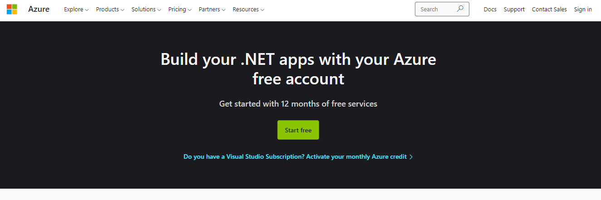
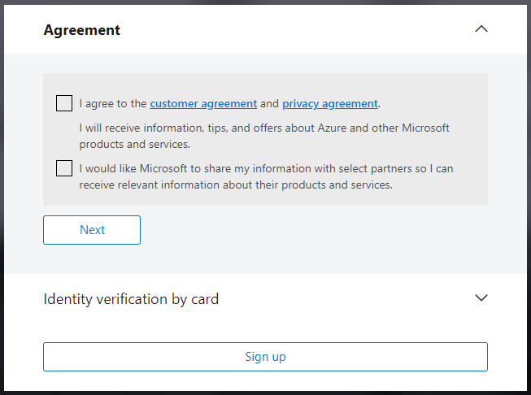
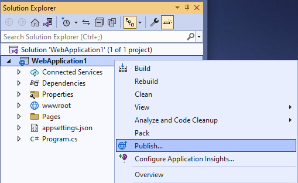
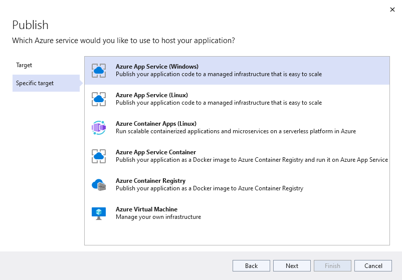

# Publish your web app to Azure 🥳

Welcome! In this lesson, we'll teach you how to publish your web apps from the previous weeks' activities to Azure! We'll do this using Azure App Service.

## What is Azure App Services and why are we publishing our apps? 

Azure App Service is an HTTP-based service for hosting web applications, REST APIs, and mobile back ends. This service adds security, load balancing, autoscaling, automated management, and more to your applications. You can also take advantage of its DevOps capabilities, such as continuous deployment from Azure DevOps, GitHub, Docker Hub, and other sources, package management, staging environments, custom domain, and TLS/SSL certificates. 
You can learn more in the [Azure App Service overview documentation](https://docs.microsoft.com/azure/app-service/overview).

## Create your free Azure account

If you are a full time student at an accredited 2 or 4 year university, you can create your account with $100 worth of free Azure credits! For more information on student eligibility, check out this [FAQ](https://docs.microsoft.com/azure/education-hub/azure-dev-tools-teaching/program-faq#azure-for-students). Sign up [here](https://azure.microsoft.com/free/students/).

Otherwise, you can still create a free Azure account by following these directions.
1. Follow [this link](https://azure.microsoft.com/free/dotnet/) to the Azure website to sign up for your free account.
2. Click on the green **Start Free** button.
   
3. Sign in to your Microsoft account if your are not already signed in.
4. Agree to the customer agreement

   
5. You will then be asked to provide a credit or debit card. This will make a temporary authorization on your card, but you won’t be charged unless you move to pay-as-you-go pricing.
6. Click sign up and you're ready to publish your application!

## Let's publish!
You can also find these instructions in the [Azure documentation](https://docs.microsoft.com/azure/app-service/quickstart-dotnetcore?tabs=net60&pivots=development-environment-vs).

1. Choose the web application you'd like to publish! It can be any of the projects that you created in emails 3, 4, or 5. Open up this project in Visual Studio. 
2. In **Solution Explorer**, right-click your ASP.NET Core project and select **Publish**.
    

3. In **Publish**, you'll see the following options. Select **Azure** and click the **Next** button.
    
4. Choose the **Specific target**, **Azure App Service (Windows)**. Then, click the **Next** button.
   
5. If you are not signed in to Azure or if your Visual Studio account is not linked to your Azure account, click **Add an account** or **Sign in**. If you are already signed in, select your account.
   

6. Select the **+** to the right of **App Service instances**.
   
7. For **Subscription**, accept the subscription that is listed or select a new one from the drop-down list.
8. For **Resource group**, select **New**. In **New resource group name**, enter *myResourceGroup* and select **OK**.
9.  For **Hosting Plan**, select **New**.
10. In the **Hosting Plan: Create new** dialog, enter the values specified in the following table:
    | Setting | Suggested value | Description |
    | ------- | --------------- | ----------- |
    | Hosting Plan | *MyFirstAzureWebAppPlan* | Name of the App Service Plan |
    | Location | Select the default | The datacenter where the app is hosted |
    | Size | *Free* | Pricing tier |
    
    This will look like the below.
    
    
11. Select **Create** to create the Azure resources. Once the wizard completes, the Azure resources are created for you and you're ready to publish your ASP.NET Core project.

    
12. In the **Publish** dialog, ensure your new App Service app is selected in **App Service instance**, then select **Finish**. Visual Studio creates a publish profile for you for the selected App Service app.
13. In the **Publish** page, select **Publish**. If you see a warning message, select **Continue**.Visual Studio builds, packages, and publishes the app to Azure, and then launches the app in the default browser.

Congratulations 🎉 You've just published your web applications!
